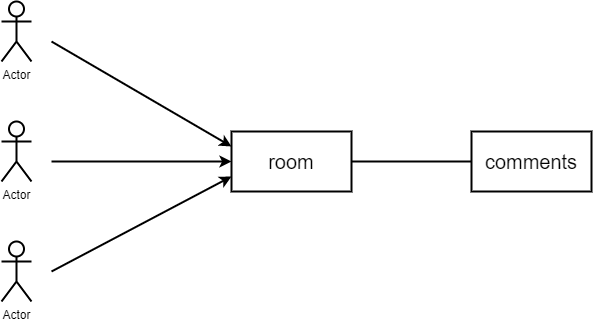
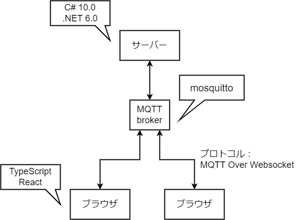
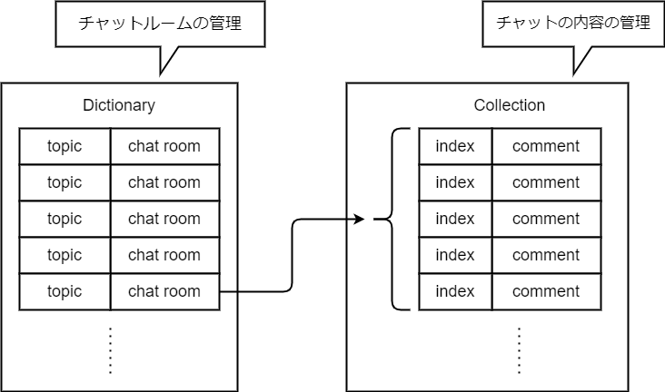

# docs

## アプリの概要
---
一つの部屋の中で複数人でチャットできる。

 

## 全体
---

 

## チャットルームとチャット
---
topic は MQTT でも活用する部屋を識別するもの。C# の Dictionary を使って topic と chat room を結びつける 
あるトピックに複数人でコメント投げ合い、投げられたコメントは chat room 内の Collection で管理する。

